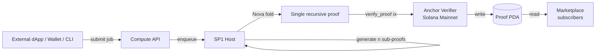

# VERIA

[](https://veria.fun)
[](https://veria.fun/docs)
[](https://x.com/veria_zk)
[](#)
[](LICENSE)
[](https://github.com/succinctlabs/sp1)
[](https://www.anchor-lang.com/)
[](https://explorer.solana.com/address/FVJLyv7HwrVSBNqVnWQccpVb9MnU1w9iZZS6Hitmyfue)
[](https://rust-lang.org)
[](https://www.typescriptlang.org/)


> Few dots. Whole truth.

VERIA is a Solana-native ZK coprocessor. SP1 zkVM runs your computation off-chain; Nova folding compresses many sub-proofs into one; an Anchor verifier program records the result on Solana mainnet. You get the answer with on-chain integrity, at one ten-thousandth of the direct compute cost.

The repository is a monorepo: five SP1 circuit programs, the Rust host that drives them, a Nova folding adapter, an Anchor verifier program, a TypeScript SDK, and a `veria` CLI distributed on npm and Homebrew.

---

## Why it exists

Solana's BPF VM caps compute per transaction. A large model inference, a 4096-element median, a sort over real-world data — none of those fit. Off-chain computation is fast, but consumers cannot tell whether the operator returned the truthful answer or a self-interested one. The fix is a zero-knowledge proof verified on-chain: it carries enough information to convince the chain, but not enough to redo the work.

The proofs themselves are large. A folding scheme such as Nova lets us pre-compress a batch of sub-proofs into a single instance whose verifier circuit fits a Solana transaction. The Anchor verifier program below accepts that single proof, runs SP1's on-chain verifier, and records the outcome in a PDA keyed by the proof hash.

Result: a permissionless marketplace where any protocol can submit "verify this computation", any other protocol can read "yes, here's the answer, here's the on-chain commitment", and the work itself happens off-chain at zkVM speed.

---

## Architecture



Numbers visible in the production header:

```
5 / 5 circuits · 3 / 3 contracts · SP1 v3 · Solana devnet
```

The Anchor verifier program is **live on Solana mainnet** today:

| | |
|---|---|
| **Program ID** | `FVJLyv7HwrVSBNqVnWQccpVb9MnU1w9iZZS6Hitmyfue` |
| **Deploy tx** | `3vRr2ixhHCgwVd6sf23yyvSzCM78C82gkrowhFJphSkeKCGJ4oLpg3NQHzpSpNu1mNdKHu4yshhQpz2jsGc4AGfK` |
| **IDL (on-chain)** | `7Xb47jRhzyEP6LeA3tPW4XQJC2J2knpZkQ2K4e9xBrR3` |
| **BPF size** | 241,984 bytes (242 KiB) |
| **Explorer** | [`explorer.solana.com/address/AAvR1Eo3.../cluster=devnet`](https://explorer.solana.com/address/FVJLyv7HwrVSBNqVnWQccpVb9MnU1w9iZZS6Hitmyfue) |
| **Cluster** | devnet (mainnet queued for Phase 8b — same program shape, same instruction ABI) |

---

## Built-in circuits

| ID | Name | Description | Max input | Tests |
|----|------|-------------|----------:|------:|
| 1 | Scoring | Weighted average over a fixed-length score vector. | 64 | 5 |
| 2 | Aggregation | SUM, AVG, MIN, MAX over up to 4096 u64 inputs. | 4096 | 4 |
| 3 | Median | Median with sortedness witness and permutation proof. | 256 | 5 |
| 4 | Sort | Permutation proof: output monotonic, output multiset = input multiset. | 256 | 4 |
| 5 | ML Inference | Fixed-point MLP forward pass (32-16-8-4, ReLU). Weights public. | 32 | 4 |

A circuit is a SP1 guest program in `packages/circuits/<name>/program/src/main.rs`. The host wraps it in a Nova folder for batch submission.

---

## Quick start

### TypeScript SDK

```ts
import { VeriaClient } from '@veria/sdk';

const client = new VeriaClient({
  apiUrl: 'https://api.veria.fun',
  programId: process.env.VERIA_PROGRAM_ID!,
});

const fold = await client.fold({
  circuit: 'median',
  input: { values: [42, 17, 99, 33, 51, 80, 7] },
  subProofCount: 100,
});

console.log(fold.costSol, fold.savingsPct.toFixed(2) + '%');
```

### CLI

```bash
npm install -g veria-cli

veria fold input.json --circuit scoring --sub-proofs 100 --output proof.bin
veria verify --circuit scoring --proof-file proof.bin --public-file public.bin
veria circuits
veria cost --sub-proofs 1000
```

Homebrew tap (preview):

```bash
brew tap veria-labs/veria
brew install veria
```

---

## Cost model

| Sub-proofs | Direct on-chain cost | Folded cost | Savings |
|-----------:|---------------------:|------------:|--------:|
| 10         | 0.05 SOL             | 0.0001 SOL  | 99.80%  |
| 100        | 0.50 SOL             | 0.0001 SOL  | 99.98%  |
| 1000       | 5.00 SOL             | 0.0001 SOL  | 99.998% |

The constant 0.0001 SOL reflects the on-chain Anchor `verify_proof` compute-unit cost — verifying the final SNARK, not the original computation. The folding adapter compresses N sub-proofs into one instance whose verifier circuit fits a single Solana transaction.

---

## Repository layout

```
packages/
  zkvm-host/          Rust + SP1 SDK — off-chain prover, Nova folding adapter
  circuits/           5 SP1 guest programs (scoring, aggregation, median, sort, ml-inference)
  verifier-program/   Anchor mainnet verifier — IDL published on-chain
  sdk-ts/             @veria/sdk
  cli/                veria-cli (npm + Homebrew)
apps/
  web/                Next.js 15 landing + visualizer + docs
docs/
  architecture.md     System design and data flow
  circuits.md         Per-circuit input/output schemas
  security.md         Trust model and boundary checks
  academic-references.md   SP1, Nova folding, Jolt, recursive SNARKs
```

---

## Academic references

VERIA implements three lines of research and packages them into a Solana-native service.

- **SP1** (Succinct Labs, 2024) — RISC-V zkVM, Plonk-style commitments. VERIA uses `sp1-sdk v3`.
- **Nova folding** (Kothapalli, Setty, Tzialla, CRYPTO 2022) — recursive ZK arguments from folding schemes; soundness under SXDH.
- **SuperNova** (Kothapalli, Setty, 2022) — non-uniform IVC, required for batches mixing different circuits.
- **Jolt** (Arasu, Setty et al., 2024) — lookup-centric VM. Tracked for roadmap inclusion.
- **Bitansky, Chiesa, Tromer** (STOC 2013) — original recursive SNARK composition / IVC.
- **Yakovenko, Solana whitepaper** (2017) — Sealevel parallel runtime, why distinct PDAs never contend.

Full citations in [docs/academic-references.md](docs/academic-references.md).

---

## Trust model

- The prover is **untrusted**. SP1 soundness implies a passing proof reflects the actual guest execution on the committed inputs.
- The Compute API is trusted for **availability**, not correctness. Any party can re-run and verify independently.
- The Anchor verifier program is the single source of truth. `ProofRecord` PDAs are seeded by `[b"proof", &sha256(proof || public)]` and use `init` (not `init_if_needed`) to prevent replay rewrites.
- The marketplace stores **only** the verification record on-chain. Proof bytes live off-chain (caller's responsibility).

Full threat model and disclosure policy in [docs/security.md](docs/security.md).

---

## Development

```bash
# Workspace install
pnpm install

# JavaScript / TypeScript build
pnpm build
pnpm test

# Rust circuits + host
cargo build --workspace --release
cargo test --workspace

# Anchor verifier (requires solana-cli + anchor-cli)
cd packages/verifier-program
anchor build
anchor test --skip-deploy

# Local dev web
pnpm web:dev   # apps/web on :3000
pnpm api:dev   # private Compute API service on :8000
```

Node 20+, Rust stable + nightly for `sp1-build`, Solana CLI 1.18+, Anchor 0.31.

---

## Roadmap

- v0.1 — five circuits, Nova folding, Anchor devnet verifier, SDK, CLI, web visualizer.
- v0.2 — registry program for permissionless circuit onboarding; SuperNova non-uniform IVC.
- v0.3 — Jolt backend swap, hosted prover network, Risc0 backend pluggability.
- v0.4 — proof marketplace subscriptions, oracle integrations.

---

## License

Apache-2.0. See [LICENSE](LICENSE).
