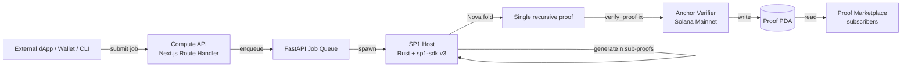

# VERIA Architecture

## Overview

VERIA is a Solana-native ZK coprocessor service. The architecture splits responsibility across four layers:

1. **Submission Layer** — Web UI, CLI, SDK accept computation requests.
2. **Proving Layer** — SP1 zkVM hosts execute guest programs; Nova folding compresses recursive proofs.
3. **Verification Layer** — Anchor verifier program on Solana mainnet validates the folded proof and records the result in a PDA.
4. **Marketplace Layer** — Other protocols subscribe to verified results (Pyth-like price feed model).



## Submission Layer

Three entry points, all hitting the same Next.js Route Handler `/api/fold`:

- **Web Visualizer** (`/visualizer`) — the 1st hook. Slider chooses sub-proof count (10/100/1000); the UI animates the Three.js dot field self-assembling while the proof generates server-side.
- **TypeScript SDK** (`@veria/sdk`) — `client.fold({ circuit, input })` returns `{ proofId, costSol, foldedProofBytes }`.
- **CLI** (`veria fold input.json --circuit scoring`) — the 3rd hook. Streams progress to stderr, writes proof to stdout.

The Route Handler is a same-origin proxy to FastAPI, eliminating CORS in the browser path.

## Proving Layer

### SP1 Guest Programs

Each circuit lives in `packages/circuits/<name>/program/src/main.rs` and compiles to a SP1 ELF. The guest program reads input from `sp1_zkvm::io::read`, performs the deterministic computation, and commits the public outputs.

Five circuits ship in v0.1.0:

- `scoring` — weighted average over a fixed-length vector.
- `aggregation` — SUM/AVG/MIN/MAX over up to 4096 inputs.
- `median` — order-statistic median with a sortedness witness.
- `sort` — permutation proof: input multiset equals output multiset, output is monotonic.
- `ml-inference` — fixed-point MLP forward pass (2 hidden layers, ReLU). Used for verifiable AI agent decisions.

### Recursive Folding (Nova / SuperNova)

`packages/zkvm-host/src/folding.rs` adapts each sub-proof into a Nova instance and folds them sequentially. After `n` folds, a single instance-witness pair is compressed into a final SNARK proof verifiable on Solana.

For non-uniform circuits (mixing different programs), the host can switch to a SuperNova augmented circuit.

### Cost Model

| Sub-proofs | Direct on-chain cost | Folded cost | Savings |
|-----------:|---------------------:|------------:|--------:|
| 10         | 0.05 SOL             | 0.0001 SOL  | 99.80%  |
| 100        | 0.50 SOL             | 0.0001 SOL  | 99.98%  |
| 1000       | 5.00 SOL             | 0.0001 SOL  | 99.998% |

The constant 0.0001 SOL reflects the on-chain Anchor `verify_proof` compute-unit cost (verifying the final SNARK, not the original computation).

## Verification Layer

### Anchor Program

`packages/verifier-program/programs/veria-verifier/src/lib.rs` exposes one core instruction:

```rust
pub fn verify_proof(
    ctx: Context<VerifyProof>,
    proof_bytes: Vec<u8>,
    public_inputs: Vec<u8>,
    circuit_id: u8,
) -> Result<()>
```

It runs SP1's on-chain verifier against the provided proof. On success it writes a `ProofRecord` PDA seeded by `[b"proof", &proof_hash]`:

```rust
#[account]
pub struct ProofRecord {
    pub circuit_id: u8,
    pub public_inputs_hash: [u8; 32],
    pub verified_at: i64,
    pub submitter: Pubkey,
}
```

### Sealevel Parallelism

Each `ProofRecord` PDA is uniquely seeded, so verifying many distinct proofs in the same block does not contend for the same account write lock — full Sealevel parallelism preserved.

## Marketplace Layer

External protocols read `ProofRecord` accounts by hash and integrate the verified result. The proof bytes themselves are not stored on-chain (too large); only the verification record and hash are. The dApp keeps the proof bytes off-chain (IPFS, R2, or just memory).

This is a Pyth-like model: producers (provers) publish verified facts; consumers (dApps) read them.

## Module Map

| Path | Language | Responsibility |
|------|----------|----------------|
| `packages/zkvm-host/` | Rust | SP1 prover wrapper, Nova folder, CLI host binary |
| `packages/circuits/<n>/` | Rust (no_std) | SP1 guest programs |
| `packages/verifier-program/` | Rust (Anchor) | On-chain verifier (Solana mainnet) |
| `packages/sdk-ts/` | TypeScript | Browser/Node SDK; wraps Compute API + Anchor verify |
| `packages/cli/` | TypeScript (Node bin) | `veria` CLI; wraps SDK |
| `apps/web/` | TypeScript (Next.js) | Landing + Visualizer + Docs |
| the private Compute API service | Python (FastAPI) | Job queue, SP1 host invocation, Solana mainnet RPC |

## Trust Boundaries

- The SP1 host (prover) is **untrusted**. A malicious prover cannot forge a passing proof for an incorrect output — that is the soundness of SP1.
- The Compute API is trusted only for **availability**, not correctness. Anyone can re-run the proof and verify on-chain independently.
- The Anchor verifier is the single source of truth. Once `verify_proof` succeeds, the result is final.
